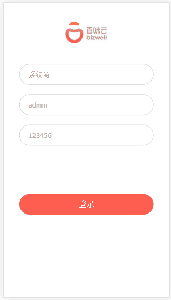
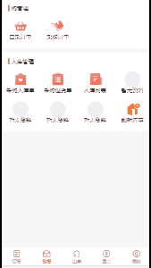

# React技术栈+Express+Mongodb实现商家供应链

## 功能描述

***前端部分***

- [x] 订货列表展示
- [x] 门店分类
- [x] 登录管理
- [x] 个人中心管理
- [x] 收货管理
- [x] 出库管理
- [x] 盘点管理

***后端部分***
- [x] mongoose数据库操作
- [x] 路由管理
- [x] 身份验证
- [x] 基本的增删改查
- [x] ...

## 技术栈
- [x] react
- [x] mobx-react
- [x] react-router
- [x] mobx
- [x] babel
- [x] webpack
- [x] Express
- [x] Mongodb
- [x] Mongoose

## TODO

- 下订单 

## 项目运行效果
- 下单

- 其它banner

- 店面分类

## 运行
    
    npm i
    
    npm start
    

